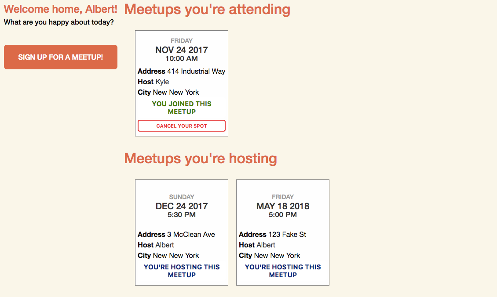
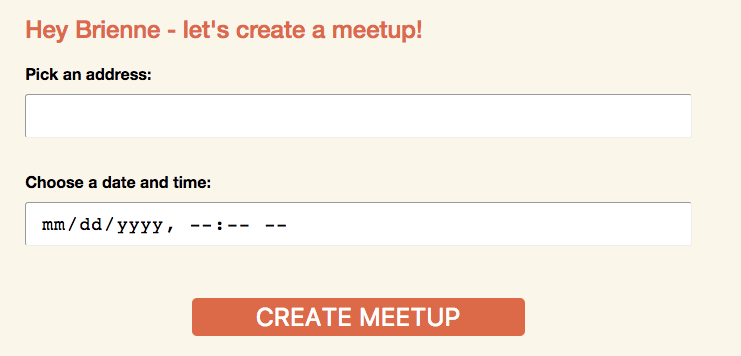

# COFFEE WITH STRANGERS

[](https://travis-ci.org/akorn3001/CoffeeWithStrangers)

[Coffee With Strangers](https://coffee-with-strangers.herokuapp.com/) is
a full-stack web application modeled after Tea With Strangers. It uses Ruby on
Rails as a back-end framework in conjunction with a PostgreSQL database, and React
with Redux for the front-end. The application allows users to host meetups and sign
up for meetups hosted by other users.

## Displaying meetups on the user's dashboard



In the backend I utilized a users table, meetups table, and an attendances join table
to store my data. The join table was necessary because hosts can have many meetups,
but regular users can also have many meetups.

A key feature of the site is the ability to sign up for and host meetups. After a
user does either, the meetup will be displayed in their dashboard. In order to
accomplish this, I had to select all of the user's meetup objects in an array and
then filter depending on whether the user's id matched the meetup's host_id. I
provided attended and hosted meetups as props in my container:

```javascript
const mapStateToProps = state => {

  return {
    currentUser: state.session.currentUser,
    attended_meetups: selectAllMeetups(state).filter((meetup) => meetup.host_id !== state.session.currentUser.id),
    hosted_meetups: selectAllMeetups(state).filter((meetup) => meetup.host_id === state.session.currentUser.id)
  };
};

```

A challenge I faced with this approach initially was that a user's hosted meetups
would not appear in the dashboard unless the host attended their own meetup. To
fix this problem I changed the way I was joining my meetups table with my
attendances join table to be a left outer join instead of an inner join, selecting
then all of the user's meetups instead of just the ones they were attending. I
performed this query in the Users Controller's index action:

```Ruby
def index
  if params[:city_id]
    @meetups = Meetup.where(city_id: params[:city_id])
  else
    @meetups = Meetup.joins("LEFT OUTER JOIN attendances on attendances.meetup_id = meetups.id").where("attendances.attendee_id = #{current_user.id} or host_id = #{current_user.id}")
    # @meetups = current_user.invitations
  end
  ```

  ## Allowing users to become hosts and create meetups
  

  Another important feature of Coffee With Strangers is the ability for regular users to
  become hosts. Not every user can create their own meetups, and so the ability
  to become a host is vital for maintaining future meetups. Ideally there would be a
  process in which the potential hosts would be vetted, making the distinction
  between host and regular user less trivial. But for the purposes of the application
  as it now stands users can click a button to fill out their hosting information
  before they can create meetups.

  All this is accomplished through the use of a `:host_status` column in the users
  table. When I initially envisioned the project I decided that a user would become
  a host by toggling their `host_status` from `false` to `true`. Once I got to this
  point in the project, however, I realized that simply switching from regular user
  to host user would be rather trivial, and that an intermediate step would be required,
  where the user could fill out their hosting information and also upload a profile
  photo.

  The problem I encountered was that my data type for `:host_status` was still
  set to `:boolean` and it took me a bit of time to realize it must be set to
  `:string` in order to accommodate the intermediate step of `pending`:

  ```javascript

  if (this.props.currentUser.host_status === "false") {
    hostingContent = hostingSchpiel;
  } else if (this.props.currentUser.host_status === "true") {
    hostingContent =
    <div className="hosting-below-banner">
      <CreateMeetupFormContainer />
    </div>;
  } else {
    hostingContent =
    <div className="hosting-below-banner">
      <BecomeHostFormContainer />
    </div>;
  }
}
  ```


### Features to come back to in the future
* Using libraries such as Moment.js to provide a more robust way to allow the
user to input the date when creating meetups;
* Stronger validations on email / password formats;
* Allow users to edit or cancel their hosted meetups;
* Allow hosts to see list of users attending their meetups

<!-- * Ruby version

* System dependencies

* Configuration

* Database creation

* Database initialization

* How to run the test suite

* Services (job queues, cache servers, search engines, etc.)

* Deployment instructions

* ... -->
